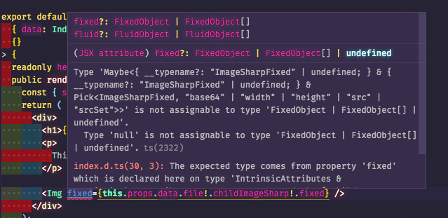

# Quick test of Gatsby with graphql codegen

Generated types are included, but if you want to generate them again, run:

    yarn start
    # in another terminal
    yarn graphql-codegen

## Issue

The issue I'm facing is that typings for Gatsby Image are using `undefined`
while GraphQL uses `null` as return value for fields that didn't return anything
(like for no results or errors).

